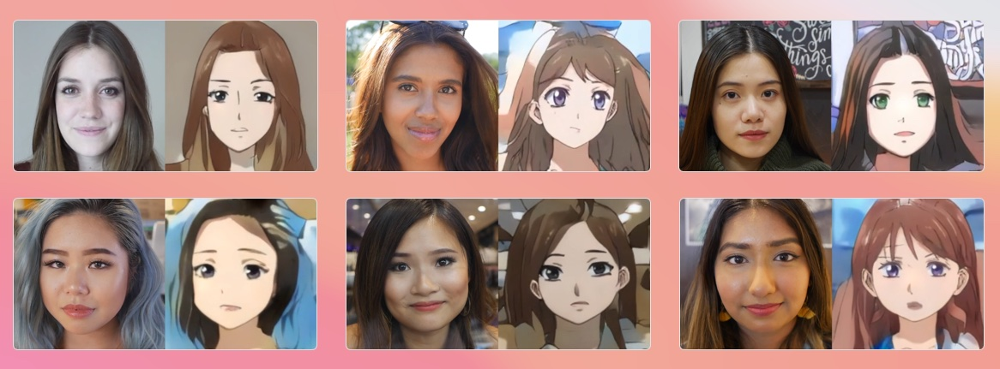
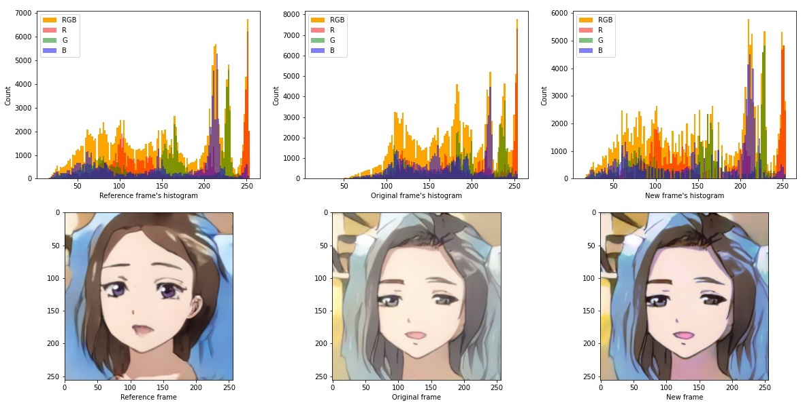
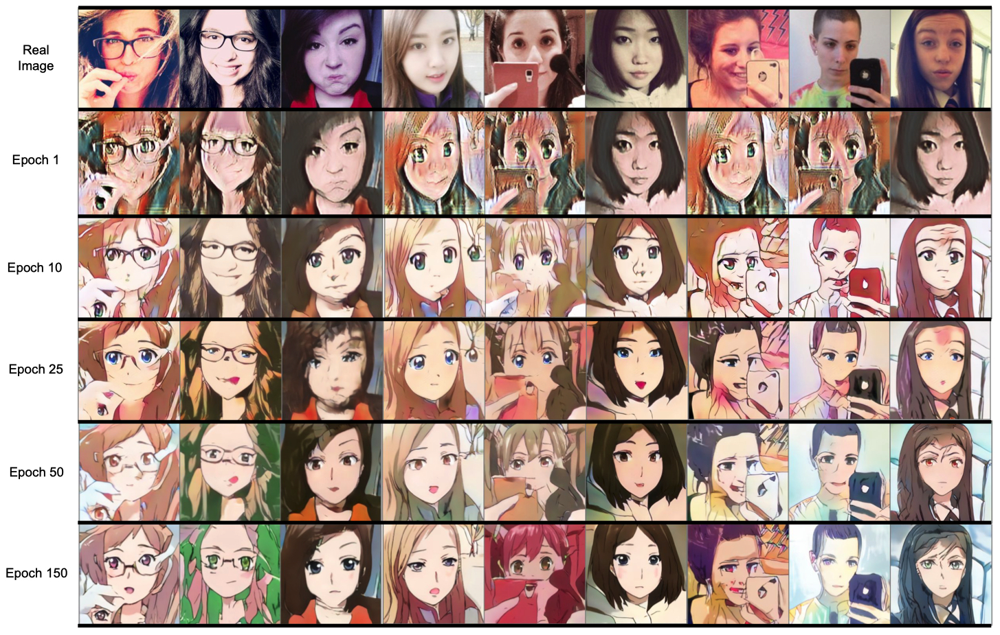

# Real-Time Face to Anime Style Video Translation
### Rutgers ECE Machine Vision Final Project
### Huy Phan, Peri Akiva

Original paper [Unsupervised Generative Attentional Networks with Adaptive Layer-Instance Normalization for Image-to-Image Translation (Junho Kim, Minjae Kim, Hyeonwoo Kang, Kwanghee Lee)](https://github.com/taki0112/UGATIT). UGATIT is originally used for image to image translation. In this project, we want to apply UGATIT to video.

# Qualitative Results
**Face to Anime Video Translation Results:** https://www.youtube.com/watch?v=NZepV-hC_ZY

**Histogram Matching**
- Promote consistency between frames, eliminate flickering.

**Training Progress**

# How to use
Link to pretrain model: https://rutgers.box.com/shared/static/d2xr2jpn8gfyxkhre6ob0agegjbkb8cu.pt

## Requirement
- pytorch == 1.7
- torchvision == 0.8.2
- pytorch-lightning == 1.0
